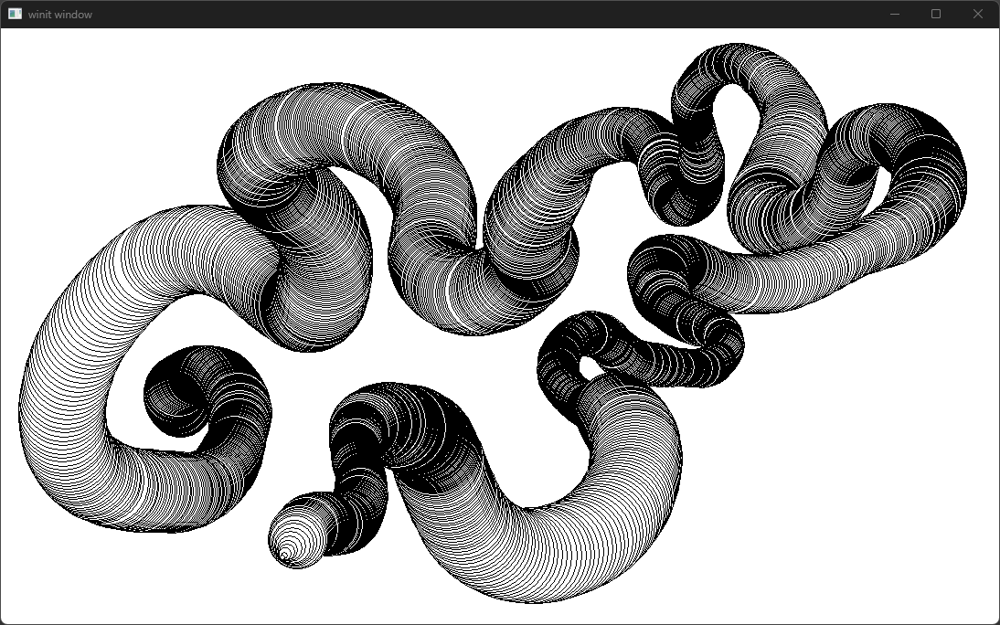

# Rust Pen Tablet / Pen Display Input Capture

This workspace contains several crates (plus some extras, see further below)
with different attempts to capture input from my Huion Kamvas Pro 24 Pen
Display.

This repo was originally motivated because there was a problem with the windows ink functionality, and therefore the [`octotablet`](https://crates.io/crates/octotablet) crate was not working for me. At the time, the only working option was Wintab32, so i spent a lot of time getting that working and ended up publishing the [`wintab_lite`](https://crates.io/crates/wintab_lite) crate. Since then the driver issues have resolved, and all the various attempts below started working for me. Oh well, I learned a lot!

This repo just contains some examples for the various different ways I know to get pen tablet pressure on windows. I would probably recommend using `octotablet` as your first option through.

1. `test_windows_pointer_api` (Works!)
   - Reads [`WM_POINTERUPDATE` events](https://learn.microsoft.com/en-us/windows/win32/inputmsg/wm-pointerupdate)
     (part of the
     [Pointer Input Messages and Notifications](https://learn.microsoft.com/en-us/windows/win32/inputmsg/messages-and-notifications-portal)
     API) directly using the `windows` crate

2. `test_winit_with_octotablet` (Works!)
   - Uses the [`octotablet`](https://github.com/Fuzzyzilla/octotablet) crate to access pen events, but in a
     much more abstracted and idiomatic way. `winit` provides a much easier mechanisim to create a window.
   - `octotablet` currently provides access via the
     [`RealTimeStylus` api](https://learn.microsoft.com/en-us/windows/win32/tablet/realtimestylus-reference)
     which is documented as "Legacy User Interaction Features - ... Windows 7
     and Earlier".
3. `test_wintab_lite_with_libloading` (Works!)
   - Uses my crate `wintab_lite` and `libloading`.
   - `wintab_lite` was originally part of this repo, but can now be found at the links below
     - <https://github.com/thehappycheese/wintab_lite>
     - <https://crates.io/crates/wintab_lite>
4. `test_wintab_with_bindgen` (Works - Terminal Output Only)
   - uses the wintab interface maintained by Wacom, using `bindgen` and `libloading`
   - `clang` must be installed and the `LIBCLANG_PATH` environment variable must
    be set
   - I have distributed the C headers listed below with this repo because I
     found them
     [here](https://github.com/Wacom-Developer/wacom-device-kit-windows/tree/881d8e8303e858e53584e70235fe32e3c9ef06f2/Wintab%20Pressure%20Test/SampleCode/Wintab)
     under an
     [MIT licence](https://github.com/Wacom-Developer/wacom-device-kit-windows/blob/881d8e8303e858e53584e70235fe32e3c9ef06f2/Wintab%20Pressure%20Test/SampleCode/MIT-license.txt)
     however please note that the headers themselves contain a
     [copyright notice](https://github.com/Wacom-Developer/wacom-device-kit-windows/blob/881d8e8303e858e53584e70235fe32e3c9ef06f2/Wintab%20Pressure%20Test/SampleCode/Wintab/WINTAB.H#L4C1-L10C81) ¯\\_(ツ)_/¯.
     - `MSGPACK.H`
     - `PKTDEF.H`
     - `WINTAB.H`
   - My code does not close the context properly, so beware potential issues. I
     was pleasantly supprised that i managed to get this option working at all!
5. `test_wintab_winit` (Works)
   - Tests the types defined in `wintab_lite` by trying to use them with `winit`

## Usage

For `test_windows_pointer_api`, `test_winit_with_octotab` and `test_wintab_lite_libloading` you will be able to draw in the window that appears

- Mouse input will not draw anything
- Space bar will clear the screen

> NOTE: `test_wintab_with_bindgen` does not have the drawing code implemented!

## Extra Packages

- `test_print_type_sizes` contains python notebooks and experiments used to
  understand `struct` memory layout using the experimental compiler flag
  `rustc -Z print-type-sizes`
-  This little tool is probably worth splitting into its own repository in
   future, as it turned out to be quite handy.